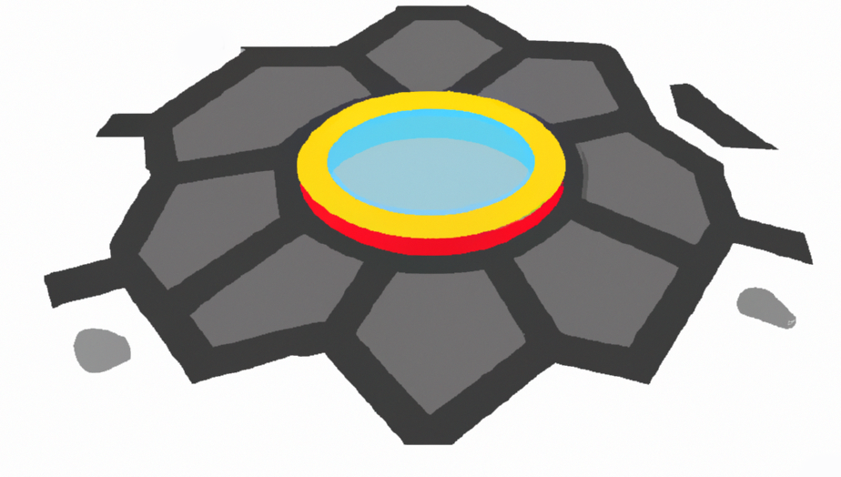

# Pothole Perusal, Predictor Program: QuadP



> **Planning Pothole potential using pointcloud from a ply file, powered by python, pacing on the pipad**


__QuadP__ is a program that can scan potholes and calculate their volume. This volume can be used to assist civil engineers in the process of patching potholes. By having this information, engineers can more efficiently fill potholes, ensuring that our roads are safer for everyone. These pothole scans can also be integrated into a __digital twin__ model of a city or road, allowing engineers to use VR or AR to experiment with new pothole patching materials without having to use any physical resources 

## About 
- Software designed to scan potholes and calculate volume 
- Software will automatically establish reference plane and calculate volume of all spaces beneath plane
- Using this reference plane method, the volume of multiple potholes can be calculated
- Using the calculated volume and density provided by user mass of required material can be calculated
- Software is entirely written in python using as few libraries as possible
- Currently only compatible with python 3.6-3.9, but should function for 3.10 once Open3D releases the patch supporting it
- software is opensource under the LGPL Liscense, pull requests are welcomed: see LISCENSE


> Example of the problem this software is designed to solve


## Hardware requirements 
- 1.5 ghz CPU
- 4gb RAM 
- [Intel Realsense Depth Mapping Camera 400 series or greater](https://www.intelrealsense.com/introducing-intel-realsense-d400-product-family/)


## Software Requirements
- [Python Versions = 3.6 - 3.9](https://linuxhint.com/install-python-ubuntu-22-04/)

### Package Requirements
- [numpy](https://numpy.org/doc/)
- [matplotlib](https://matplotlib.org/stable/index.html)
- [open3d](http://www.open3d.org/docs/)
- [sqlite3](https://docs.python.org/3/library/sqlite3.html)
- [tkinter](https://docs.python.org/3/library/tk.html)
- [opencv](https://docs.opencv.org/4.x/index.html)
- [intelrealsenseSDK](https://dev.intelrealsense.com/docs)
- [pywebview](https://pypi.org/project/pywebview/)

## Algorithms used 
- Principal component analysis algorithm to establish a reference plane 
- Least square fit on a 3D plane to restablish reference plane
- Normal calculation to remove points above reference plane
- ConvexHull method to calculate volume 

## Useful references
- [3DMatplotExamples](https://jakevdp.github.io/PythonDataScienceHandbook/04.12-three-dimensional-plotting.html)
- [LibrealsenseGithub](https://github.com/IntelRealSense/librealsense.git)

## Installation Process 

First navigate to your desired location on the host filesysten 

```bash
cd ~/Documents/Quadp
```

Clone this git repo from the master branch to your desired location 

```bash
git clone https://github.com/Yalton/CSCI_Capstone.git
```

Install all required libraries and create symlinks to ~/.local/bin by running this command from within the /src directory 

Note: (Script will create the ~/.local/bin directory if it does not already exist)

```bash
./install.sh
```

Finally  the program can be ran simply by executing the __quadp__ executable 

Note: (quadp is a wrapper for launching the python script)

```bash
quadp
```

Enjoy!

